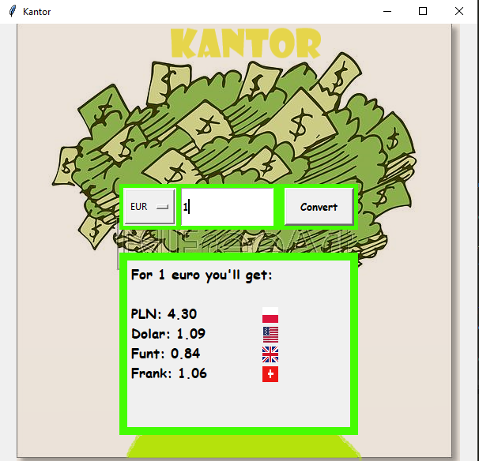

# Currency Converter(Tkinter)

The app uses free API to get the current rates of currencies: USD, EURO, GBP, CHF.

### Installing

I haven't created Procfile, beacause you only need tkinter and PIL installed to run this app.

